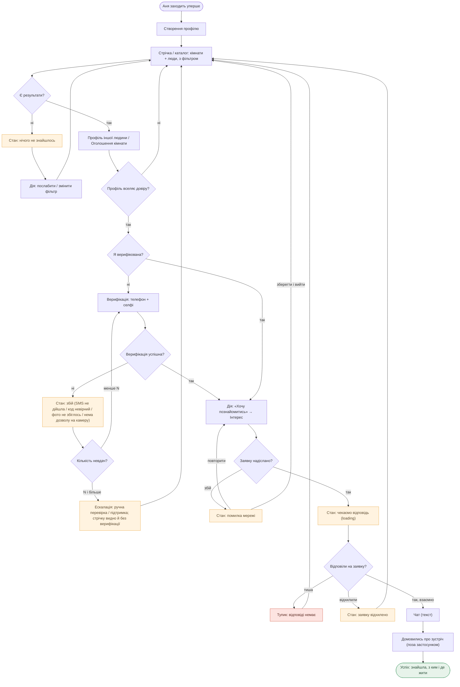
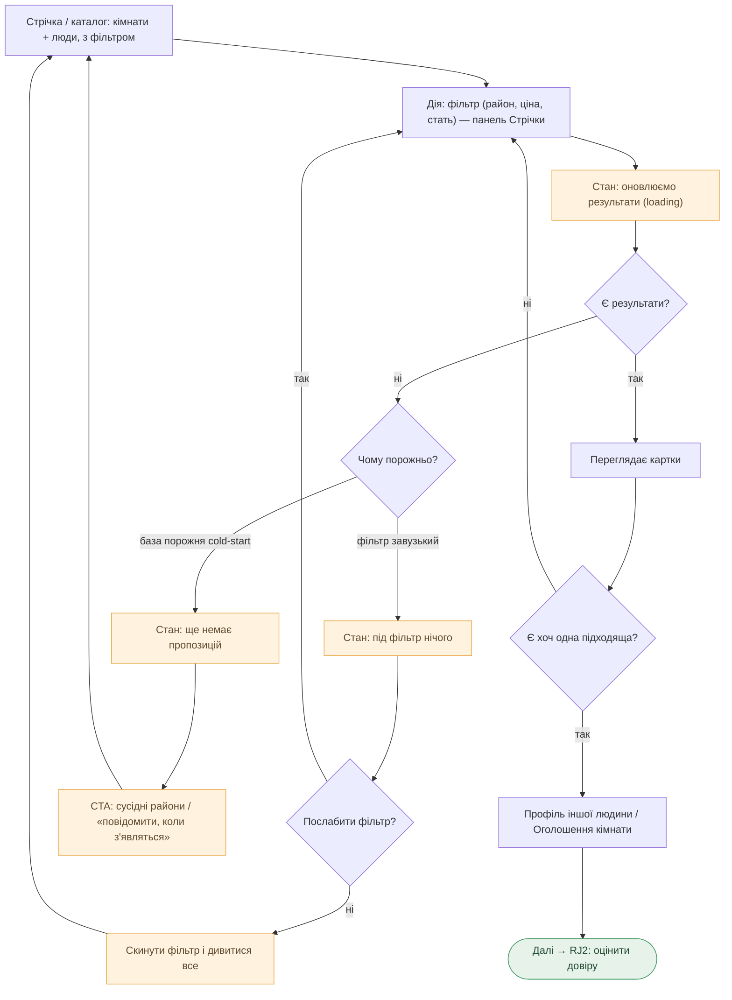
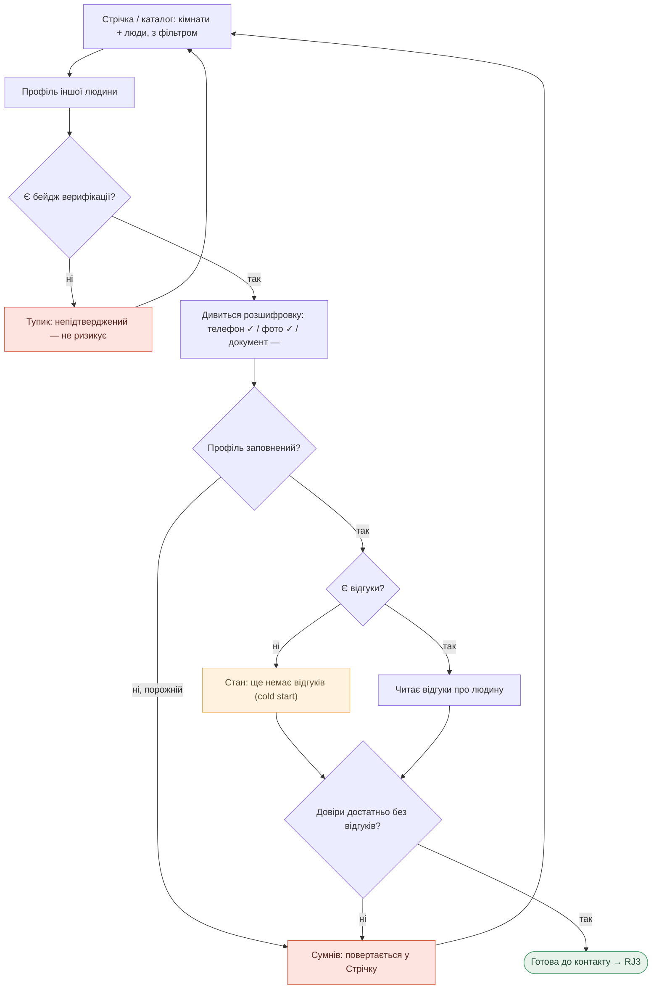
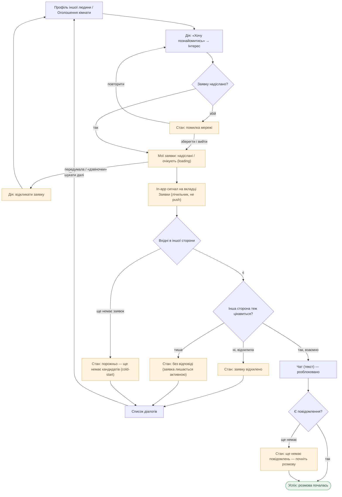
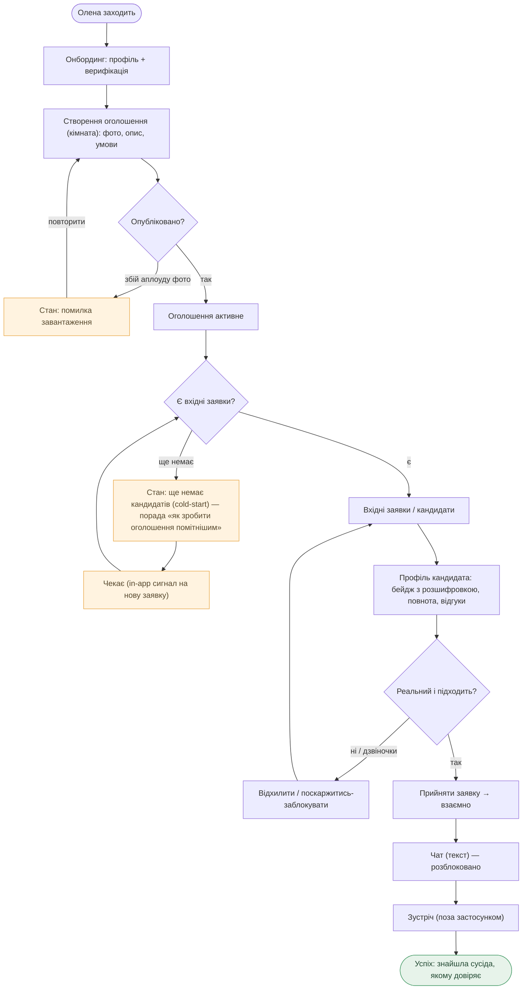

# User Flows — Куток

> Чернетка. Кожен flow — під заголовком job ([jtbd.md](./research/jtbd.md)).
> Вузли `[у квадратних]` = екрани зі [sitemap.md](./sitemap.md), розділ «Екрани». Рішення `{ромб?}`.
> Показано не лише happy-path: стани **empty / loading / error** — окремими вузлами, і обидва кінці — успіх **і** тупики.
>
> **Легенда станів і кінців** (єдина для всіх діаграм):
> - помаранчевий — проміжний стан (empty / loading / error)
> - червоний — тупик, де людина застрягає
> - зелений — успішний кінець
>
> **Звірка зі sitemap:** усі вузли-екрани існують у sitemap.md. Нових екранів не введено — «Хочу познайомитись» і «фільтр» лишаються діями/станами екранів (як зафіксовано в sitemap), не окремими екранами.
>
> **Периметр (свідоме обмеження).** Намальовано: MAIN, RJ1, RJ2, RJ3 (бік Ані-шукача) + бік **господаря (E, Олена)**. Поки без діаграм: RJ4 (готовність до зустрічі — покриває екран «Профіль іншої людини» + лінк із чату), RJ5 (відгуки — post-MVP; якір заселення в [sitemap.md](./sitemap.md)), SJ1/SJ2, EJ1/EJ2. Безпекові гілки (скарга/блок, re-verify фото, приватність) — рішення у [sitemap.md «Рішення безпеки і приватності»](./sitemap.md#рішення-безпеки-і-приватності-до-wireframes).

---

## MAIN JOB — безпечно знайти, з ким і де жити

> *Коли я шукаю людину для спільного проживання серед незнайомих, я хочу бути впевненою, що вона реальна, щоб прийняти рішення без страху пошкодувати.*
> Primary — Аня (шукач). Повний наскрізний flow.

**Точки зриву:** порожня стрічка (empty) → послаблення фільтра або відвал (cold-start окремо — див. RJ1); збій верифікації → після N невдач **ескалація** (не вічна петля), стрічку видно й без неї; тиша/відмова на заявку — найчастіше. Успіх відбувається **поза застосунком** (зустріч), тож продукт відповідає лише за безпечний шлях до неї — і за утримання розмови до зустрічі ([sitemap: anti-Viber](./sitemap.md#рішення-безпеки-і-приватності-до-wireframes)).

---

## RJ1 — знайти серед багатьох тих, хто базово підходить

> *Коли я починаю шукати серед десятків профілів, я хочу швидко відсіяти тих, хто точно не підходить.*
> Фокус: фільтр і стан порожнього результату.

**Точки зриву:** два різні «порожньо» — *фільтр завузький* (→ послабити / скинути) і *cold-start, база порожня* (→ сусідні райони / «повідомити, коли з'являться»). Жоден більше не термінальний тупик; на старті домінує саме cold-start, і послаблення фільтра тут не зарадить.

---

## RJ2 — переконатися, що людина реальна, до будь-якого контакту

> *Коли я натрапила на профіль, що здається підходящим, я хочу переконатися, що це реальна людина, щоб не ризикувати наодинці з незнайомцем.*
> Ядро MVP. Фокус: trust layer — бейдж із розшифровкою, повнота, відгуки.

**Точки зриву:** відсутній бейдж = миттєвий тупик (research R1/R2); порожній профіль = сумнів; **cold start відгуків** — empty-стан, що на старті стосуватиметься майже всіх профілів (тому відгуки = post-MVP).

---

## RJ3 — почати розмову тільки якщо інтерес взаємний

> *Коли я вирішила написати першою, я хочу знати, що людина навпроти теж відкрита, щоб не відчувати, що вторгаюсь.*
> Ядро MVP. Двосторонній gate: чат відкривається лише при взаємності.

**Точки зриву:** відмова й тиша — два різні негативні кінці (відхилення видиме, тиша — ні, але заявка лишається активною); порожні вхідні й порожній чат на старті — стани за замовчуванням (cold-start); без **in-app сигналу** обидві сторони мусили б навмання перевідкривати вкладки → відчуття «мертвого» продукту (research, патерн №4 «коли ламається»). Можливість **відкликати** заявку — дія безпеки.

---

## E (бік господаря) — підселити, не впустивши «не ту людину»

> *Коли я підселяю в свій дім, я хочу відфільтрувати кандидатів до зустрічі й переконатися, що людина реальна, щоб не впустити проблему.*
> Олена. Сторона пропозиції: майже не користується стрічкою — її «пошук» це перегляд кандидатів, що прийшли на оголошення.

**Точки зриву:** аплоуд фото (error/loading); **порожні вхідні на cold-start** — стан за замовчуванням на старті, тому потрібна порада, а не просто порожнеча; «реальність» кандидата тримається на тому ж бейджі з розшифровкою (RJ2 з боку господаря). `[?]` Відкрите: якщо primary — Олена, її головний шлях (E → кандидати) не має шорткату-стрічки — перевірити на інтерв'ю.

---

*Чернетка, `flows.md`. Покрито: MAIN, RJ1, RJ2, RJ3 (Аня) + E (Олена-господар). Джерела: [jtbd.md](./research/jtbd.md), [sitemap.md](./sitemap.md). Усі вузли-екрани звірені зі sitemap (+ «Мої заявки», керування акаунтом і дія скарга/блок додані там же); нових екранів поза sitemap не введено. Наступне: RJ4/RJ5 за потреби → wireframes.*
