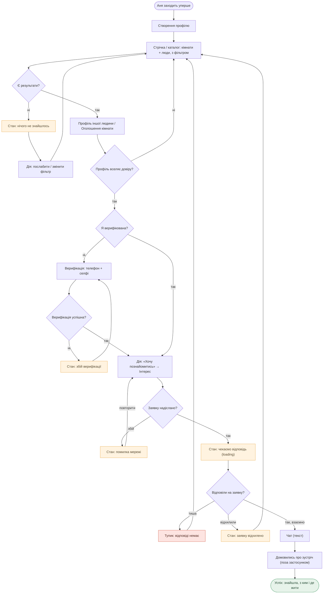
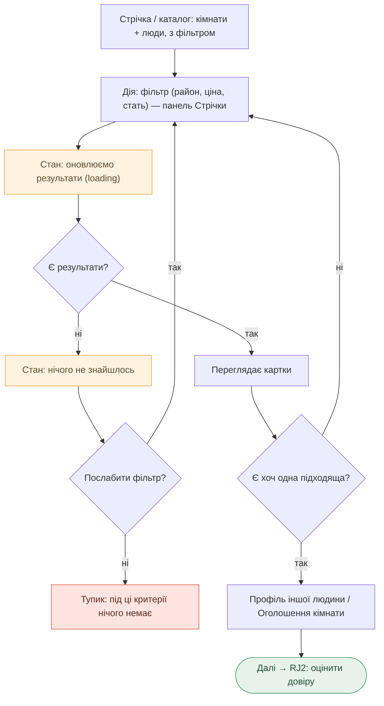
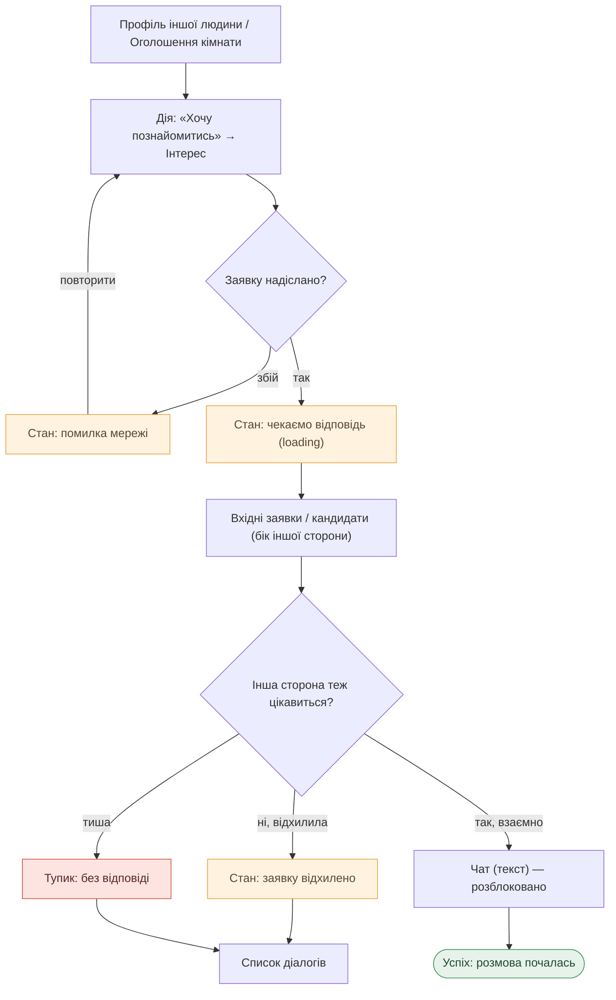

# User Flows — Куток

> Чернетка. Кожен flow — під заголовком job ([jtbd.md](./research/jtbd.md)).
> Вузли `[у квадратних]` = екрани зі [sitemap.md](./sitemap.md), розділ «Екрани». Рішення `{ромб?}`.
> Показано не лише happy-path: стани **empty / loading / error** — окремими вузлами, і обидва кінці — успіх **і** тупики.
>
> **Легенда станів і кінців** (єдина для всіх діаграм):
> - помаранчевий — проміжний стан (empty / loading / error)
> - червоний — тупик, де людина застрягає
> - зелений — успішний кінець
>
> **Звірка зі sitemap:** усі вузли-екрани існують у sitemap.md. Нових екранів не введено — «Хочу познайомитись» і «фільтр» лишаються діями/станами екранів (як зафіксовано в sitemap), не окремими екранами.

---

## MAIN JOB — безпечно знайти, з ким і де жити

> *Коли я шукаю людину для спільного проживання серед незнайомих, я хочу бути впевненою, що вона реальна, щоб прийняти рішення без страху пошкодувати.*
> Primary — Аня (шукач). Повний наскрізний flow.

**Точки зриву:** порожня стрічка (empty) → послаблення фільтра або відвал; збій верифікації блокує контакт; тиша/відмова на заявку — найчастіший тупик. Успіх відбувається **поза застосунком** (зустріч), тож продукт відповідає лише за безпечний шлях до неї.

---

## RJ1 — знайти серед багатьох тих, хто базово підходить

> *Коли я починаю шукати серед десятків профілів, я хочу швидко відсіяти тих, хто точно не підходить.*
> Фокус: фільтр і стан порожнього результату.

**Точка зриву:** «paradox of choice» навпаки — занадто вузький фільтр → порожньо → тупик або зациклення на послабленні.

---

## RJ2 — переконатися, що людина реальна, до будь-якого контакту

> *Коли я натрапила на профіль, що здається підходящим, я хочу переконатися, що це реальна людина, щоб не ризикувати наодинці з незнайомцем.*
> Ядро MVP. Фокус: trust layer — бейдж із розшифровкою, повнота, відгуки.

**Точки зриву:** відсутній бейдж = миттєвий тупик (research R1/R2); порожній профіль = сумнів; **cold start відгуків** — empty-стан, що на старті стосуватиметься майже всіх профілів (тому відгуки = post-MVP).

---

## RJ3 — почати розмову тільки якщо інтерес взаємний

> *Коли я вирішила написати першою, я хочу знати, що людина навпроти теж відкрита, щоб не відчувати, що вторгаюсь.*
> Ядро MVP. Двосторонній gate: чат відкривається лише при взаємності.

**Точки зриву:** відмова й тиша — два різні негативні кінці (відхилення видиме, тиша — ні); мала база на старті → мало взаємних інтересів → відчуття «мертвого» продукту (research, патерн №4 «коли ламається»).

---

*Чернетка, `flows.md`. Джерела: [jtbd.md](./research/jtbd.md), [sitemap.md](./sitemap.md). Усі вузли-екрани звірені зі sitemap; нових екранів не введено. Наступне: стани екранів детально → wireframes.*
