# Скріни конкурентів

Референси, зібрані під час ресерчу (урок 01) — доказова база під механізми довіри **R1** і **R2**.
Підписи взято з [research.md](./research.md), розділ «Референси-скріни»; нових тверджень тут немає.

Файли лежать у `research/screens/`. Джерело істини по висновках — `research.md`; ця сторінка лише показує зібране.

---

## Верифікація

Як конкуренти будують шлях «доведи, що ти реальна людина» — і де саме вони ставлять гейт.

**Гейт перед бронюванням** — Airbnb не пускає до дії, доки особу не підтверджено.

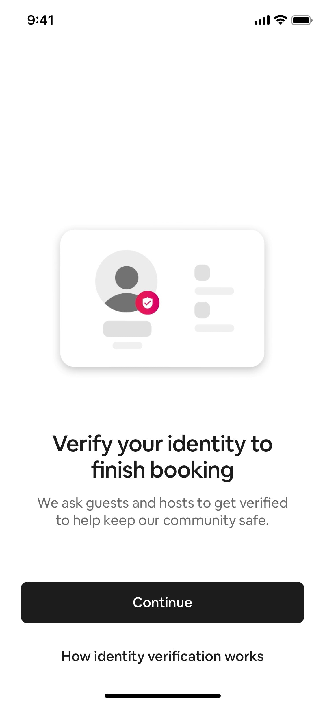

**Розшифровка, що перевірено** — окремий екран, який називає перевірені сигнали поіменно. Ключовий референс для R2: жоден UA-конкурент так не робить.

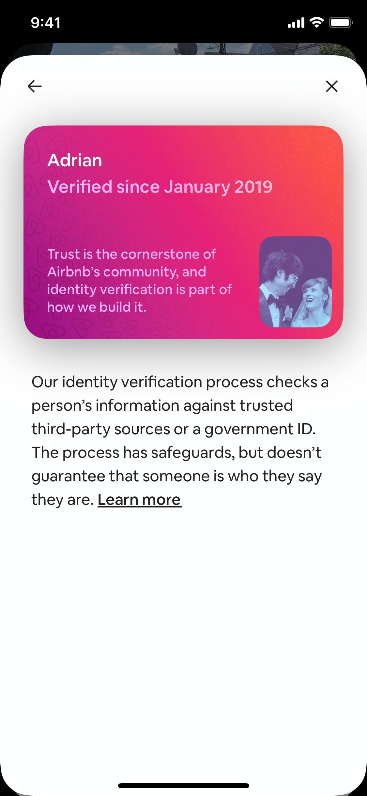

**ID-алерт у флоу поїздки** — нагадування спрацьовує в контексті дії, а не в налаштуваннях.

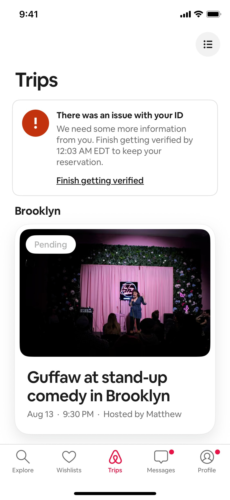

**Промпт фото-верифікації** — Tinder просить селфі-позу для звірки з фото профілю. Прямий референс під R1.

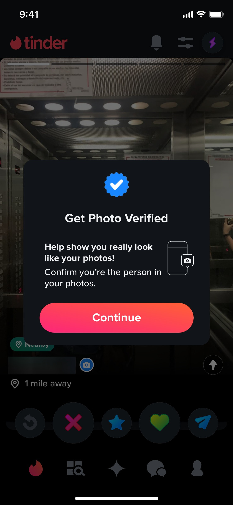

**Пояснення біометрії** — як формулюють згоду і що обіцяють зробити з даними.

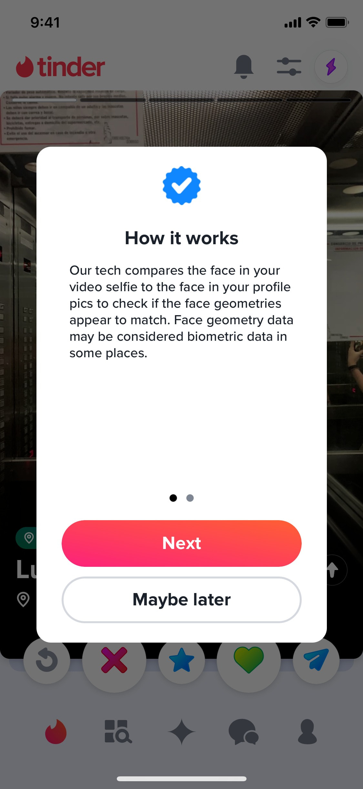

**Верифікація телефону** — базовий рівень, з якого починається R1.

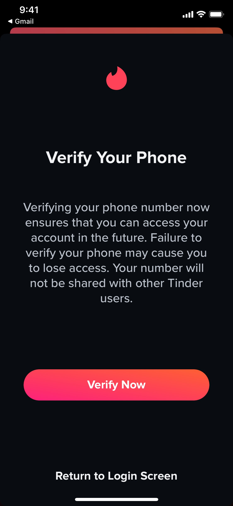

---

## Сигнали на профілі

Як перевіреність і репутація виглядають у момент рішення — на профілі й у стрічці.

**Профіль хоста з бейджем і відгуками** — повний набір сигналів на одному екрані.

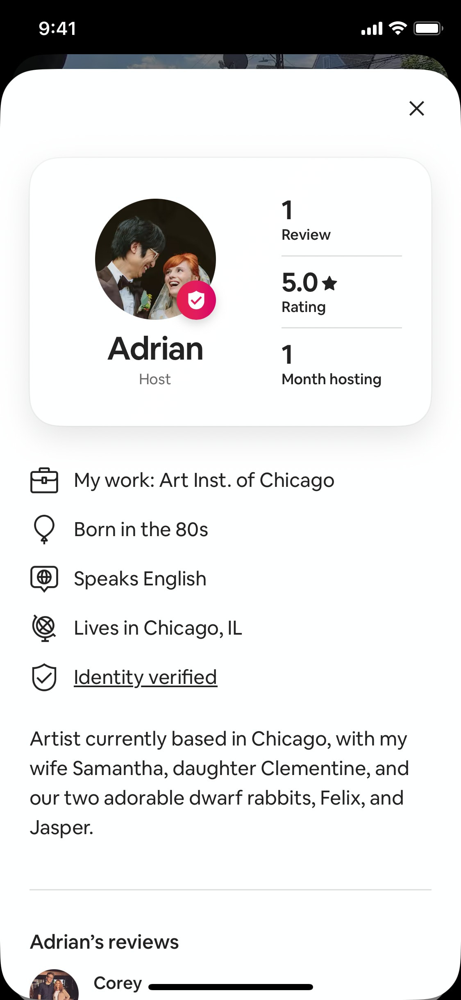

**Двосторонні відгуки (таби гості / хост)** — референс під R5.

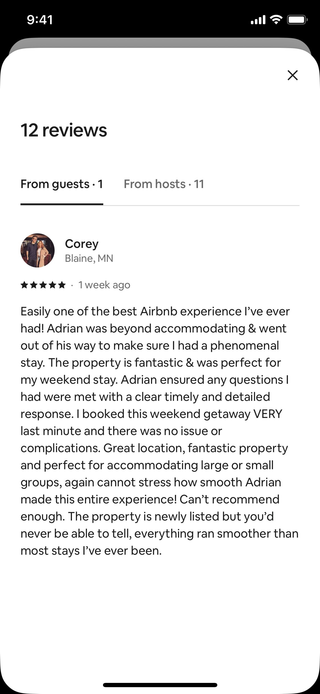

**Рейтинг з розбивкою** — оцінка розкладена на складові, а не одна цифра.

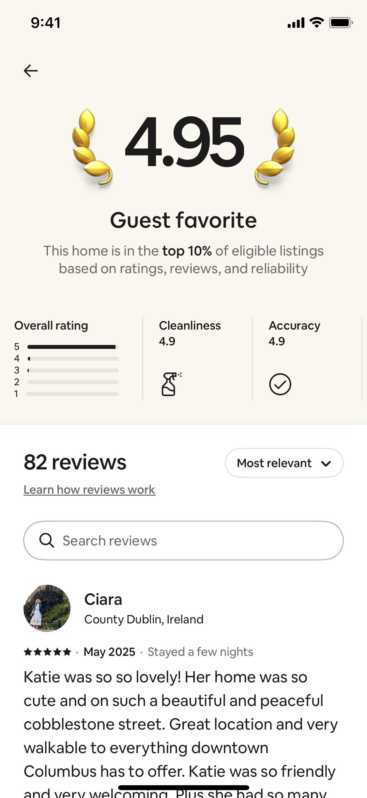

**Відгук + історія подорожей** — контекст автора відгуку як окремий сигнал довіри.

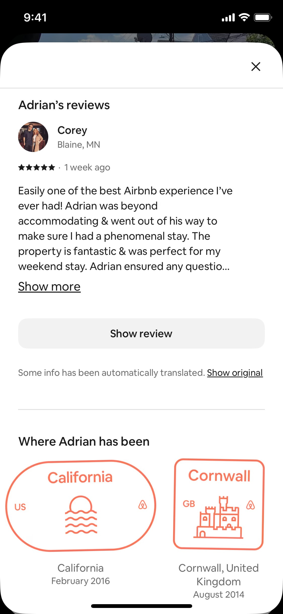

**Бейдж у картці вибору** — перевіреність видно ще до відкриття профілю.

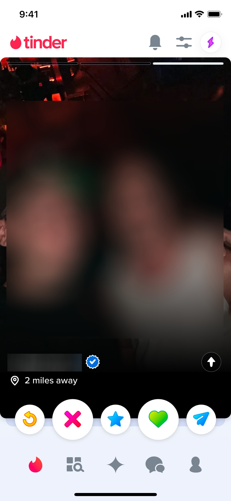

---

## Чого тут немає

Скрінів SpareRoom, Roomi, Badi й OLX ще немає — це відкритий пункт у [плані](./plan.md) і в «Наступних кроках» брифу.
